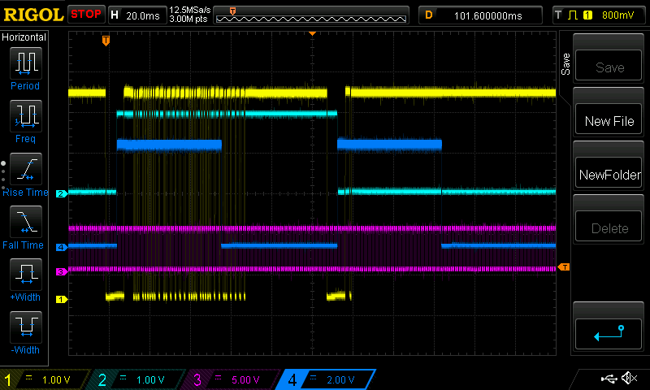

## First attempt: phototransistor

This didn't work.

## Second attempt: TSOP sensor and a constant-on signal

The sensor filtered me out.

## Debug traces




## Calculating the resistance in series with IR LED

TSAL7400 http://www.mouser.com/catalog/specsheets/tsal7400.pdf
max current: 100mA
forward voltage @ 100mA: 1.35V

During development, I'm using a 5V adapter that I found in my bag of
old junk. I cut off the connector and soldered two jumpers.

V_cc: 5v
So R = (5 - 1.35)/100mA = 36.5ohm

47ohm is the closest value >= 36.5 (to give a safety margin).

For 2 LED's in series,
R = (5 - 2*1.35)/100mA = 23ohm
22 ohm is close enough

With a 3V CR1220,	
R = (3-1.35)/100mA = 16.5ohm
22ohm is the closest I have >= 16.5 ohm

With 2 LED's,
R = (3-2*1.35)/100mA = 3ohm
4.7 ohm is the closest I have.

## Receiving

The lengths of pulses recorded are the same, no matter how much I
change my timescale! I felt trapped in a bizarro fractal universe,
where the remote was broadcasting the same signal at any level of
detail I cared to look at.

More likely, something was wrong with my timer setup code. Eventually
I took a peek at the IR Arduino library's setup code, and noticed that
he set every setup register directly to its value, even `TCNT2`,
whereas I had just assumed that the bootloader (or some other friendly
harness code that runs before mine) would set all registers to 0.

Nope. This isn't Linux any more. Nobody will clean up before you
arrive, and my carelessness was brutally punished with 2 hours of
bizarro fractal debugging. Lesson learned.

## Power struggles

Now that I have an ugly but functional solution I need to think about
how I'm going to power the final version. The receiver sits near the
speakers so it can be plugged into the wall with an AC adapter I
scavenge. That's good because it powers a servo and listens constantly
for incoming signals, both of which cost power.

The remote, on the other hand, obviously needs to carry its own. My
choices are coin battery, AA or AAA batteries. If I really can't get
my shit together then I suppose one of those huge 9v batteries is an
option, but that would be pretty embarrassing.

The `ATTiny85` datasheet has summary data about power consumption:

ATtiny85 
Operating Voltage
– 1.8 - 5.5V for ATtiny25V/45V/85V
– 2.7 - 5.5V for ATtiny25/45/85
• Speed Grade
– ATtiny25V/45V/85V: 0 – 4 MHz @ 1.8 - 5.5V, 0 - 10 MHz @ 2.7 - 5.5V
– ATtiny25/45/85: 0 – 10 MHz @ 2.7 - 5.5V, 0 - 20 MHz @ 4.5 - 5.5V
• Industrial Temperature Range
• Low Power Consumption
– Active Mode:
• 1 MHz, 1.8V: 300 µA
– Power-down Mode:
• 0.1 µA at 1.8V

Crap! Looks like I should have ordered the low-power `ATTiny85V`
variant. Assuming I get one of those, I see two modes, and boy are
they different!

With a CR1220 coin battery running at 3V (measured 3.2V) and a
capacity of 40mAh,
=> 40mAh/100mA = 0.4h
= 1440s of continuous LED discharge (ignoring ATtiny)

When I tried using the coin battery in real life, the range was worse
than what I got using a 5v AC adapter. One obvious reason for this is
that the LED is running with lower current -- the resistor in series
is calibrated to deliver 100mA (less safety margin) at 5v.

But another possible reason for bad range could be that the internal
clock runs slightly off from the measured 8.02MHz at this different
voltage. I will have to measure it and adjust.

AAA battery 1.5V
Typical capacity: 1000mAh

TSOP 1738 pin order: signal ground vcc from front (facing me)


/*
In [1]: 8000000.0/(2*38000)
Out[1]: 105.26315789473684

In [2]: X = 2*39060 * 105

In [3]: X
Out[3]: 8202600

In [4]: 8202600./(2*38000)
Out[4]: 107.92894736842105

Chip was running at 8.2026Mhz, so 108-1 = 107 gave a perfect 38KHz
modulated signal.
 */

On power down mode at 5V, I measured a current of 0.5uA (for the whole
circuit). That gives me 80,000 hours with the tiny CR220 battery,
assuming current consumption is the same at a lower voltage
(unlikely).

While a button is pressed, my multimeter reports 15mA. That the value
is lower than 100mA makes sense: just like a 200mA current at a 50%
duty cycle is reported as 100mA by this meter, the same peak current
over the much smaller duty cycle in sending bits (and the timeouts
between bytes) averages out to a lot less. We calculated 1440s of
continuous discharge. Estimating a duty cycle of 15%, we get 9600s of
discharge. Since power consumption in power down mode is a tiny
fraction of this number we can assume that the entire battery will be
consumed due to discharge. Assuming a button is held down for about 3
seconds each time volume is adjusted, we get something like 3200
volume adjustments from this tiny battery.

Is that great or is that terrible? I am such a beginner that I don't
know what is considered awful performance. On a desktop, for example,
doing millions of operations per second (megaflops) of computation
sounds impressive but is actually laughably pitiful. It is several
orders of magnitude away from good. So 3200 button presses sounds
pretty good to me but maybe it's awful.

## Soldering and bringup

## Clash of the timers

When I hooked up the now-working receiver code to the actual servo on
the speaker, the servo behaved very erratically. Had I damaged the
motor with all that working of instamorph moulding? After a lot of
debugging, I tracked the issue down to a clash of the timer used by
the Servo library, with the timer I was using for receiving.

This surprised me and I need to follow up on it. I was using timer 2,
while the Servo library uses timer 1. This is quite clear from
documentation, from the existence of a timer2 Servo library separate
from the default, from the way the compiler complains if you try to
define a timer1 interrupt handler, and forums. But I had a legitimate
test case where changing Timer2 registers messed up whether I could
make the servo turn.

The best way to figure it out is a combination of writing my own servo
library, reading the atmega328 datasheet, and reading the Servo
library source. But an even bigger consideration for me here is that
my final receiver will be an ATtiny85, not an ATmega, so if I am going
to do a deep dive on timers and PWM for any microcontroller it ought
to be the ATtiny.

### Answer: It's because I disable and enable interrupts

	ref: Using NeoPixels and Servos Together by Phillip Burgess

I use an interrupt handler running on a timer to measure intervals
between state-changes in the input from the TSOP sensor. When a
message in ready to be processed, I turn interrupts off so that if a
new message comes in, it doesn't overwrite the current one before
we're done processing it.

However, the Arduino Servo library uses timer interrupts, not a PWM
mode, so when interrupts are turned off, this throws off the waveform
being sent to ther sevo, resulting in the jittering I'm seeing.

Solution: there are two solutions here. First, I could use a PWM mode
to control the servo.
					 
Second, don't disable interrupts; instead, use a different way to lock
access to the current message. I can think of a couple ways to do
that.

1. A variable that says whether the current message is writable. This
is what I already have: if we are in STATE_MESSAGE_READY, the timer
interrupt exits immediately. But there might be a data race here.

2. I could specifically turn off timer 2 before processing the
message.

3. I could use a small circular queue buffer for messages.

## PWM frequency is off by 25% from my calculations

### Is the internal 1MHz clock really 1MHz?

Yes -- using CTC toggle mode with no prescaling and OCR0A=0, I get a
505KHz square wave. The pulse widths are pretty much spot on at 1
microsecond. Close enough.

### Can I get a 50Hz square wave in CTC mode?

Yes if I write it as OCR0A = 39.
No if I write it as OCR0A = (F_CPU / 256000) * 20 / 2;

Got it! It's a truncation bug. Rearranging like this:

OCR0A = ((F_CPU / 1000) * 20 / 256) / 2;

fixes the problem.

## Why do I love the ATTiny so much?

I am a beginner so my opinion is worthless. But I just find the ATtiny
so charming! 

## Auto syncing clocks between sender and receiver

Moving to a different timer meant I had to measure a bunch of
constants and change them in my program. That's because the lengths of
pulses sent by the ATtiny are shorter or longer depending on your
timer frequency, and there will be errors if you just assume perfectly
precise clock speeds.

This got me thinking that real implementations must sync clock
intervals as unknown hardware gets added to the network.

In preparation for something like that, I refactored my hardcoded
checks into this:

```
bool is_close_to(int value, int target) {
  return abs(value-target) < target/5;
}

const int transmitter_millisecond = 125;
const int length_of_one = 5 * transmitter_millisecond;
const int length_of_zero 250;
```

Now, when the time comes to do auto syncing of clocks, that constant
`transmitter_millisecond` will become a variable, and `length_of_one`
and `length_of_zero` will be functions that depend on the current
value of `transmitter_millisecond`.

How will the auto-syncing work? When message receipts are going
successfully (vague), we will adjust the value of
`transmitter_millisecond` so that the lengths of `one` and `zero`
pulses that we are actually seeing match what `length_of_one` and
`length_of_zero` return.

## Why did using a raw photodiode fail?

There are several things the TSOP+TSAL combo is doing better than my
first attempt. First and most fundamentally, I now believe that the
raw signal from a photodiode probably goes through a lot of gain. I
probably _was_ getting a signal, just very weak.

But gain leads to noise. They use two ways to reduce the noise. First,
there's a physical covering on the sensor that filters away things
that aren't in a certain band of wavelengths (within the infrared
region). Second, they filter away everything that isn't 38KHz.

Finally, the LED itself is a beast. It can deal with 100mA
continuously, and 200mA when flashing 38KHz with a duty cycle of 50%.

It will be very interesting to apply these lessons by trying to build
a sensor in the same style that can achieve signalling across a room. 

## How fast can we respond to input?

### Using a tight loop in the main thread

Around 9 microseconds (9 instructions) to read an input pin and copy
its state to an output pin.

### Using a timer overflow interrupt with no prescaler

About 50 microseconds in my experiments, although this will vary and
can be as bad as 255 microseconds, because the counter goes up to 255
before overflowing and causing the interrupt.

## Notes on type checking

Using WGM02 with TCCR0A should be a type error.
